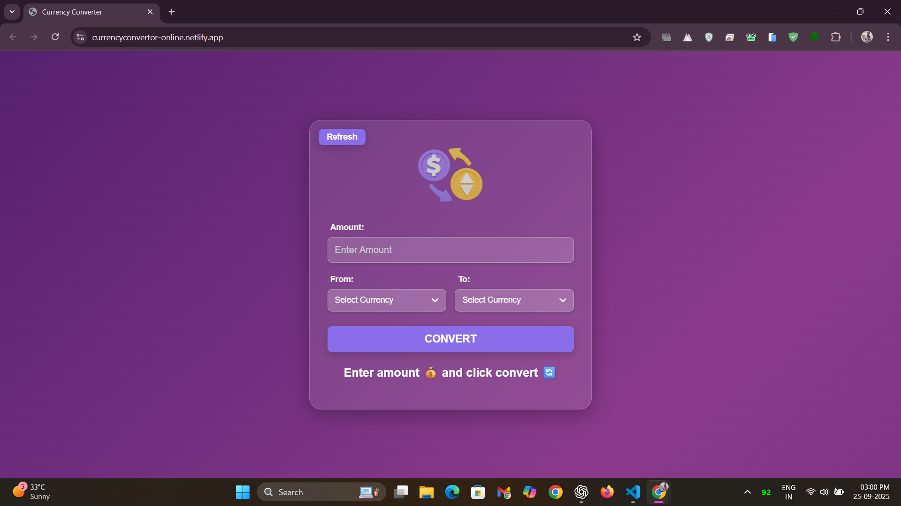
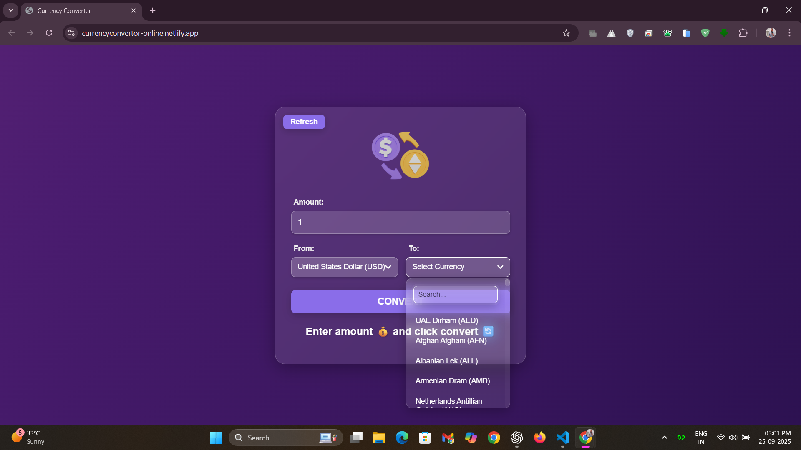
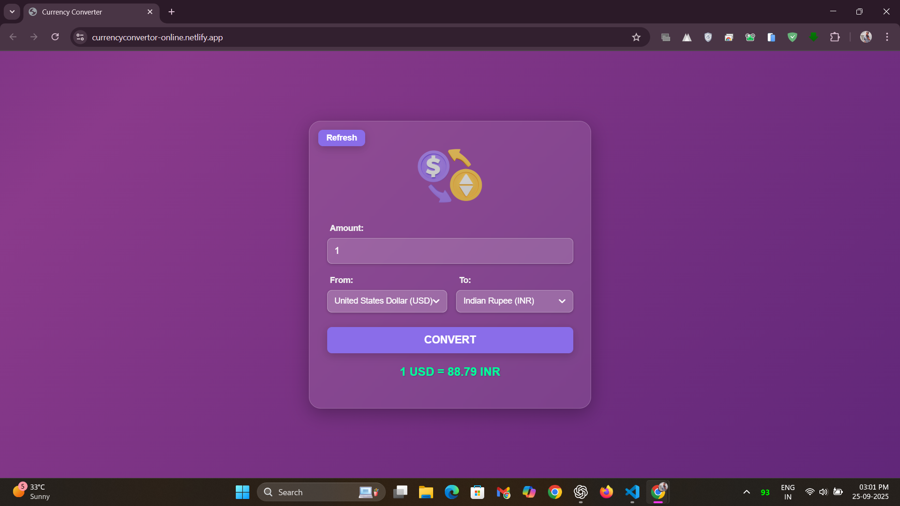
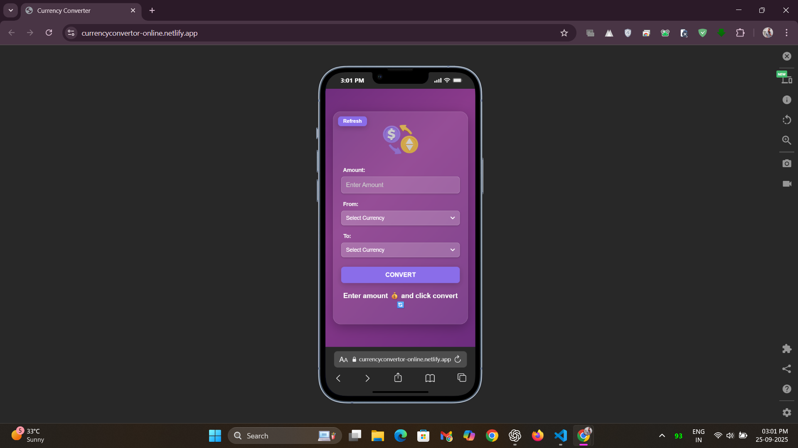

# 💱 Currency Converter

[](https://developer.mozilla.org/en-US/docs/Web/HTML)
[](https://developer.mozilla.org/en-US/docs/Web/CSS)
[](https://developer.mozilla.org/en-US/docs/Web/JavaScript)
[](LICENSE)

**A simple web application to convert currencies using HTML, CSS, and vanilla JavaScript.**

---

## 🌐 Convert your Currency : [Live Demo](https://currencyconvertor-online.netlify.app/) 

---

## 🌟 Overview
The Currency Converter is a lightweight and user-friendly web application that allows users to convert an amount from one currency to another. It is built using standard web technologies without any external libraries or frameworks.  

---

## ⚡ Features
- **Simple Interface:** Easy-to-use layout for entering amounts and selecting currencies.  
- **Real-time Conversion:** Converts currencies instantly when the user clicks the convert button.  
- **Responsive Design:** Works on both desktop and mobile devices.  
- **Vanilla JavaScript Logic:** Handles conversion calculations without relying on any frameworks.  

---

## 🛠 Tech Stack
- **HTML:** Provides the structure and content of the web page.  
- **CSS:** Styles the appearance of the converter, including layout, colors, and fonts.  
- **JavaScript (Vanilla):** Implements the application logic, such as handling button clicks and performing currency conversion calculations. No external libraries or frameworks are used.  

---

## 🖼 Screenshots
### Home Page
  
*The main interface where users can enter amounts and select currencies.*

### Currency Selection
  
*Select the currency you want to convert from and to.*

### Conversion Result
  
*Shows the converted amount instantly.*

### Mobile View
  
*Responsive design optimized for mobile devices.*

---

## 🛠 Installation / Usage

```bash
# Clone the repository
git clone <your-repo-link>

# Navigate to the project folder
cd CurrencyConverter

# Open index.html in your browser
